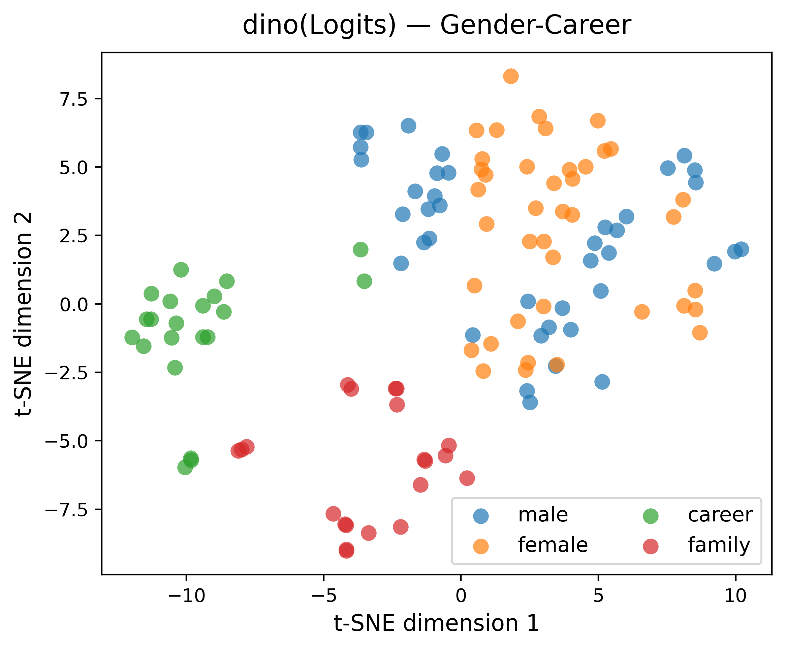
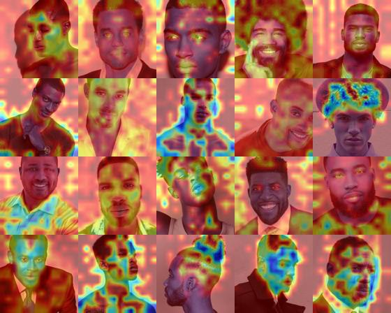
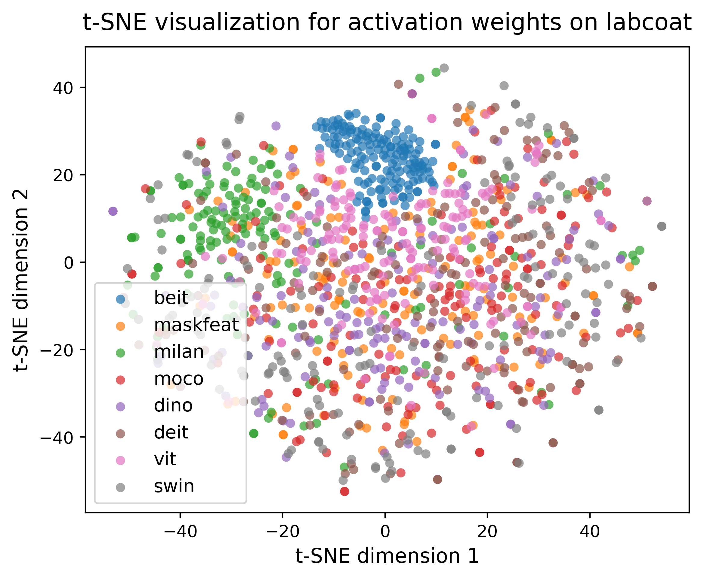
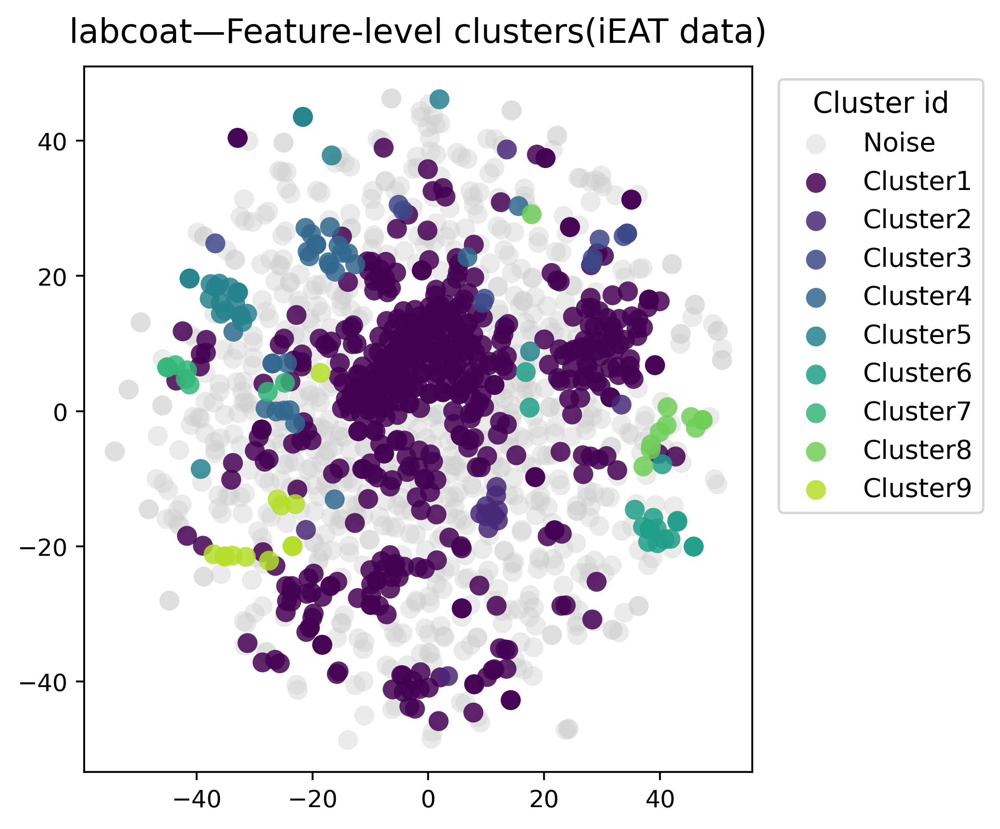

# Social Bias in Vision Transformers

**FAccT 2025 | T. Tsurumi & E. Beretta**  
*A Comparative Study Across Architectures and Learning Paradigms*

---

## Overview

This repository contains the full experimental framework for the paper:

**“Social Bias in Vision Transformers: A Comparative Study Across Architectures and Learning Paradigms”**,  
accepted at **ACM FAccT 2025**, Athens, Greece.

We evaluate how various Vision Transformers encode and amplify social biases — including **gender**, **race**, and **intersectional identity** — across **ten self-supervised and supervised ViTs**. The models tested include **BEiT, ViT, MAE, Swin, MILAN, DINO**, and others.

Our pipeline combines:
- **iEAT (Image Embedding Association Test)** to quantify bias,
- **Grad-CAM** to visualize attention patterns,
- **PCA + t-SNE + DBSCAN** to cluster activation weights and highlight structural differences in feature space.
- **Activation Ratio** to observe the distribution of activation on facial area, body area and a whole human shilouette over entire image using SAM2
---

## Repository Structure

```bash
.
├── bias_research/
│   ├── experiment.py            # Main script to run all experiments
│   ├── gradcam_utils.py         # Grad-CAM generation logic
│   ├── imagenet_label.py        # ImageNet label ID to category map
│   ├── tsne_utils.py            # t-SNE, PCA visualization functions
│   ├── dbscan_utils.py          # DBSCAN clustering functions
│   └── activation_ratio.py      # Activation Ratio calculation
├── ieat/
│   ├── api.py                   # Runs iEAT testing
│   ├── models.py                # Model wrappers for embedding extraction
│   └── ...
├── data/
│   ├── experiments/             # Contains input images from ieat
│   └── new_exp/                 # Contains resampled images from celebA
```

## Installation
1. **Clone the repository**:
```bash
git clone https://github.com/tti440/ViTs_Social_Bias_Analysis.git
cd ViTs_Social_Bias_Analysis
conda env create -f environment.yml
```
2. **Install dependencies**:
```bash
pip install -e .
pip install -e ieat 
```
3. **Install mmpretrain**:
```bash
git clone https://github.com/open-mmlab/mmpretrain.git
mim install -e mmpretrain
```

## Running the Pipeline

To reproduce all experiments (iEAT, Grad-CAM, t-SNE, DBSCAN), simply run:

```bash
python vision_bias_analysis/experiment.py
```

This will:
- Compute iEAT results at backbone/logits level
- Generate Grad-CAM maps and save .pkl data for further analysis
- Perform dimensionality reduction (PCA + t-SNE)
- Run DBSCAN clustering and save visual outputs
- Generate activation ratio csv
---
Please note that the program requires mask pkl files for the activation ratio calculation.
If you need to generate the mask pkl files, please run mask_generation.ipynb first.
In the notebook, you need to manually specify the input points for the SAM2 model and indices for generated masks you want to use: one for face and one for entire human shilouette.

## Generated Data

### iEAT Results (`.csv`)
- **File**: `ieat_results_logits.csv`
- Contains numerical outputs from the **Image Embedding Association Test (iEAT)** across ViT models.

**Columns:**
- `X`, `Y`: **Categories** (e.g., `male`, `female`, `black male`, `black female`)
- `A`, `B`: **Target sets** (e.g., `science`, `liberal-arts`)
- `d`: Effect size (standardized mean difference)
- `x_ab`: Mean difference in cosine similarity between `X–A` and `X–B` pairs
- `y_ab`: Mean difference in cosine similarity between `Y–A` and `Y–B` pairs
- `p`: p-value from permutation testing
- `sig`: Significance level (`*` for p < 0.1, `**` for p < 0.05, `***` for p < 0.01)
- `n_t`, `n_a`: Number of target and attribute items

### Grad-CAM Results (`.pkl`)
- Stored as:  
  **`{model_name}/{category}/{model_name}_{label}_{category}.pkl`**

  Example:
  ```
  vit/female/vit_labcoat_female.pkl
  swin/black-male/swin_labcoat_black-male.pkl
  ```

- Each `.pkl` contains:
  ```python
  {
    "grad": { "img1.jpg": grad_tensor, ... },
    "act":  { "img1.jpg": activation_tensor, ... },
    "grey": { "img1.jpg": grayscale_heatmap, ... }
  }
  ```

- These are used for:
  - Grad-CAM visualization
  - Activation weight extraction
  - Feature-space clustering (PCA, t-SNE, DBSCAN)

### Activation Ratio Results (`.csv`)
- Stored as:  
  **`activation_ratio/activation_ratio{model_name}.csv`**
  Example Beit:
  
| Category       | Face % | Body % | Total  |
|----------------|--------|--------|--------|
| academicgown   | 0.2412 | 0.4503 | 0.6915 |
| black-male     | 0.3702 | 0.3095 | 0.6797 |
| pajamas        | 0.1977 | 0.4806 | 0.6783 |
| desk           | 0.1823 | 0.4841 | 0.6664 |
| jeans          | 0.2050 | 0.4524 | 0.6574 |
| sunscreen      | 0.1898 | 0.4657 | 0.6555 |
| wig            | 0.2137 | 0.4335 | 0.6472 |
| miniskirt      | 0.2054 | 0.4386 | 0.6440 |
| windsor        | 0.1919 | 0.4488 | 0.6407 |
| stethoscope    | 0.2089 | 0.4293 | 0.6382 |
| suit           | 0.2055 | 0.4251 | 0.6306 |
| overall        | 0.1979 | 0.4304 | 0.6283 |
| lipstick       | 0.1996 | 0.4248 | 0.6244 |
| white-female   | 0.0923 | 0.5232 | 0.6155 |
| notePC         | 0.2077 | 0.4004 | 0.6081 |
| white-male     | 0.2582 | 0.3456 | 0.6038 |
| labcoat        | 0.1862 | 0.4107 | 0.5969 |
| female         | 0.1179 | 0.4703 | 0.5882 |
| male           | 0.1411 | 0.4456 | 0.5867 |
| cardigan       | 0.1774 | 0.4066 | 0.5840 |
| beaker         | 0.1823 | 0.3889 | 0.5712 |
| oscilloscope   | 0.1751 | 0.3912 | 0.5663 |
| bra            | 0.1825 | 0.3802 | 0.5627 |
| library        | 0.0439 | 0.1012 | 0.1451 |
| black-female   | 0.0439 | 0.1012 | 0.1451 |


### Visual Outputs
- Grad-CAM collages:
  ```
  vit/female/vit_labcoat_female.jpg
  ```
- t-SNE & DBSCAN visualizations:
  ```
  DBSCAN/labcoat_DBSCAN.png
  activation_weights/activation_weights_labcoat.png
  ```
Example:




---

## Contact

- **Elena Beretta** – [elena.beretta@vu.nl](mailto:elena.beretta@vu.nl)
- **Takehiro Tsurumi** – [t.tsurumi@student.vu.nl](mailto:t.tsurumi@student.vu.nl)

---
